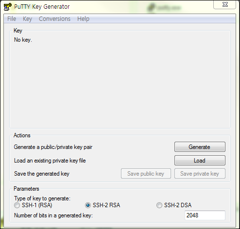
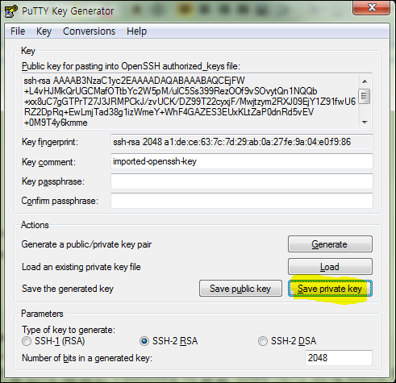

Putty download 
===============

<http://www.putty.org/> 에서 다운로드 받아 설치한다.

Putty용 Private Key변환
=======================

puttyGen파일을 실행한다.

Oracle Cloud 인스턴스 생성시 만든 Private Key파일을 Load하기 위해 Menu에서
ConversionImport Key를 누른다.

아래와 같이 파일이 Load가 되면 Save Private Key를 눌러 ppk파일로 변환합니다.

Putty로 서버 접속
=================

아래의 Host Name에 Oracle Cloud Host 인스턴스의 서버 IP를 입력합니다.

Auto-login username에 접속할 사용자 이름인 opc를 입력합니다.

Putty에서 해당 파일을 인증키로 사용하기 위해서 ConnectionSSHAuth 탭에서 위에서
저장한 .ppk 파일을 선택한다.

Open을 눌러서 아래와 같이 Host에 접속합니다.

