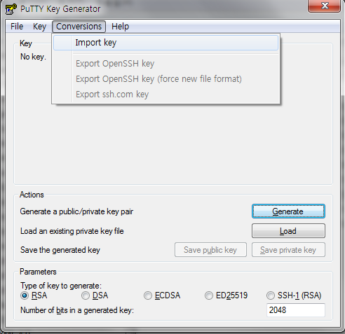
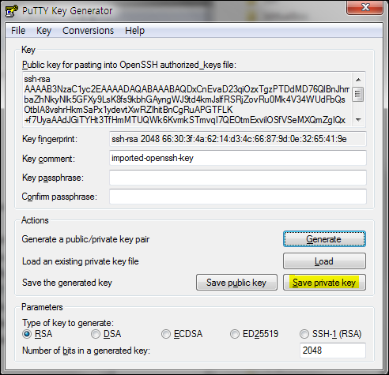
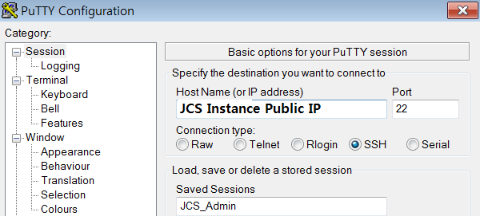
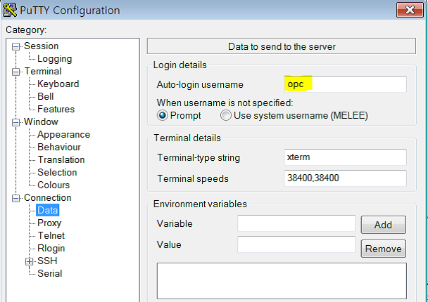
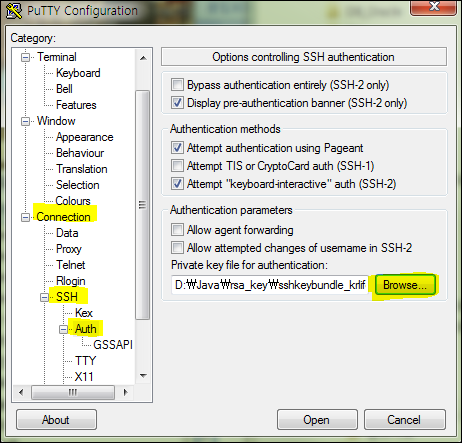
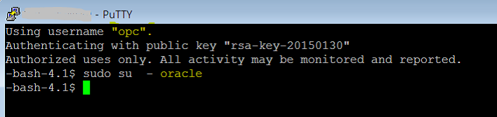

Putty download 
===============

<http://www.putty.org/> 에서 다운로드 받아 설치하거나, 
아래쪽 링크에서 putty.exe 와 puttygen.exe 만 다운로드 받으면 됩니다.

Putty용 Private Key변환
=======================
오라클 클라우드에서 만들어진 privateKey는 putty에서 별도의 putty전용 파일로 변환해야 합니다.

puttyGen파일을 실행합니다.

Oracle Cloud 인스턴스 생성시 만든 Private Key파일을 Load하기 위해 Menu에서
Conversions -> Import Key를 누릅니다. (메일로 전달한 압축 파일을 풀면 privateKey 파일이 있음)

아래와 같이 파일이 Load가 되면 'Save Private Key'를 눌러 ppk파일로 변환합니다.

적당한 이름으로 저장을 한 후에 아래에서 다시 사용합니다.

Putty로 서버 접속
=================
putty.exe를 실행합니다.

아래의 Host Name에 Oracle Cloud Host 인스턴스의 서버 IP를 입력합니다.

Auto-login username에 접속할 사용자 이름인 opc를 입력합니다.

Putty에서 해당 파일을 인증키로 사용하기 위해서 ConnectionSSHAuth 탭에서 위에서
저장한 .ppk 파일을 선택한다.

Open을 눌러서 아래와 같이 Host에 접속합니다.

